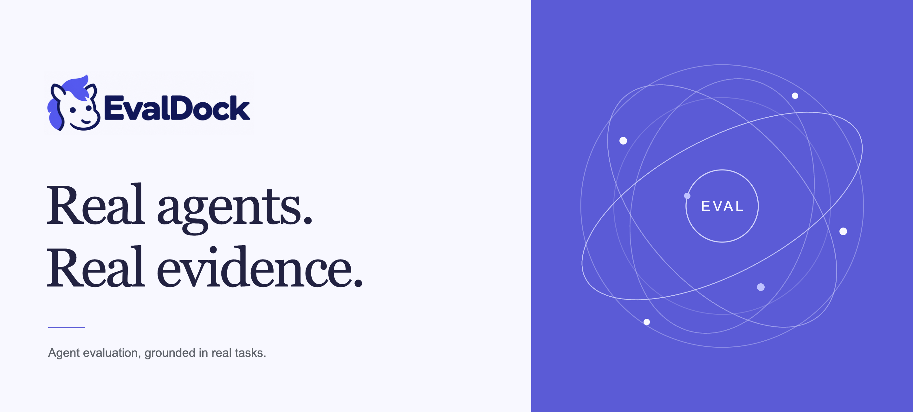
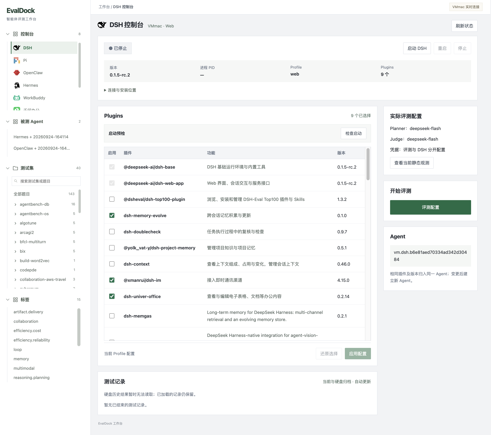
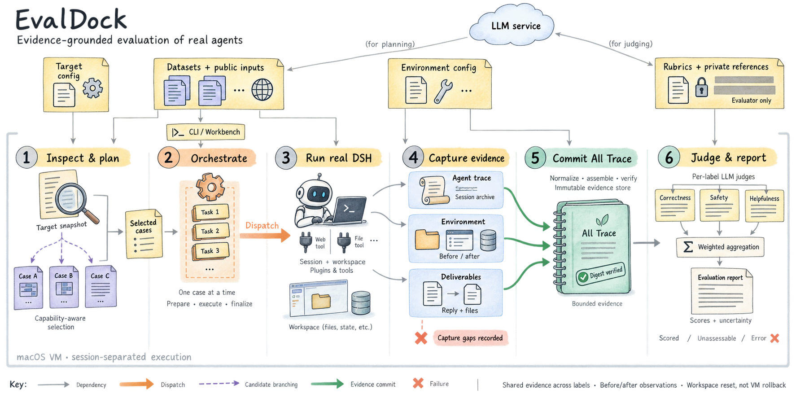
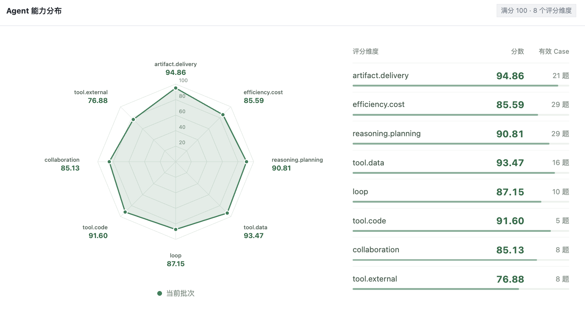
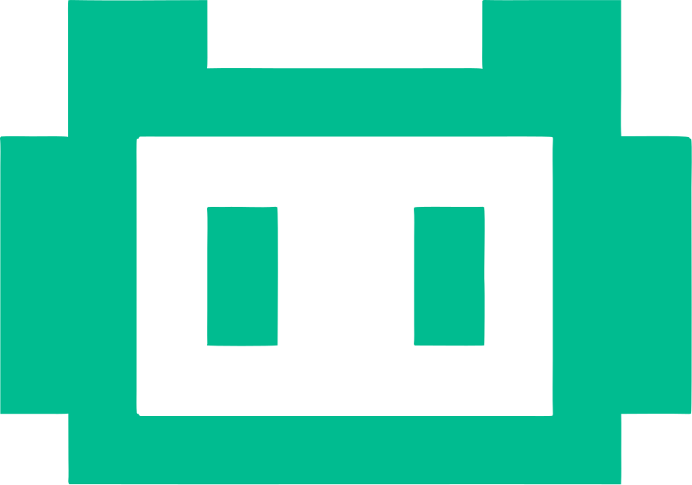

<p align="center">
  <a href="https://www.evaldock.ai/">
    
  </a>
</p>

<h1 align="center">EvalDock</h1>

<p align="center">
  <a href="README.md"></a>
  <a href="README.zh-CN.md"></a>
</p>

<p align="center"><strong>面向异构 Agent +插件 的全链路评测框架</strong></p>
<p align="center">An end-to-end evaluation framework for heterogeneous agents and plugins.</p>

<p align="center">
  <a href="https://www.evaldock.ai/"></a>
  <a href="#部署与数据集"></a>
  <a href="https://github.com/evaldock/EvalDock/actions/workflows/ci.yml"></a>
  <a href="https://github.com/evaldock/EvalDock/stargazers"></a>
  <a href="#已接入的-agent"></a>
  <a href="#数据集覆盖"></a>
  <a href="examples/datasets/README.md"></a>
  <a href="labels/README.md"></a>
  <a href="package.json"></a>
  <a href="package.json"></a>
  <a href="src/all-trace/types.ts"></a>
  <a href="#评分方式"></a>
</p>

<p align="center">
  <strong>官方网站：<a href="https://www.evaldock.ai/">https://www.evaldock.ai/</a></strong>
</p>

## 目录

- [项目介绍](#项目介绍)
- [工作台预览](#工作台预览)
- [评测流程](#评测流程)
- [评分方式](#评分方式)
- [已接入的 Agent](#已接入的-agent)
- [数据集覆盖](#数据集覆盖)
- [部署与数据集](#部署与数据集)
- [评测结果](#评测结果)
- [开发](#开发)
- [接入新的 Agent](#接入新的-agent)
- [参与贡献](#参与贡献)
- [交流群](#交流群)

---

## 项目介绍

EvalDock 用来测试不同 Agent，以及同一 Agent 在不同插件配置下的表现。它负责选题、运行任务、记录过程和评分，结果可以在本地工作台查看。

不同 Agent 使用各自的执行适配器，共用题库、All Trace 格式和 Judge。每道题会保存工具调用、输出文件、分数和评分依据，便于检查结果或复测。

工作台支持选择 Agent 和插件、配置 Planner / Judge API Key、指定题目、启动或取消评测。下面是控制台和单题结果页。

## 工作台预览

[](docs/assets/workbench-console.png)

展示 Agent 与插件配置；不分发包含真实题目答案或判分说明的结果截图。

## 评测流程

<p align="center">
  <a href="docs/assets/evaluation-workflow.png">
    
  </a>
</p>

图中以 DSH 为例。当前支持下文列出的 8 类 Agent，默认同时执行 3 道题；图中的串行执行和评分汇总是早期设计。

1. **观测与选题**：读取 Agent 版本、工具和插件信息，交给 Planner 选择测试集。也可以手动指定题目。
2. **执行任务**：准备独立工作目录，将题目与公开输入交给 Agent；评分参考留给 Judge。
3. **采集证据**：Probe 记录 Agent 的工具调用和回复，文件观测记录工作目录变化与交付物，统一保存为 All Trace。
4. **评分**：Judge 根据题目参考、标签标准和 All Trace 逐维度评分，生成 JSON / HTML 报告。

### 选题与难度

支持手动选题，或由 Planner 选择 3–10 个测试集、每集 3–7 题（不足 3 题取全部）。自动抽题以简单 20%、中等 40%、困难 40% 为目标比例。[抽题规则](planning/case-sampling.md)。

### Trace 采集

Probe 在事件发生或任务结束时采集证据，合并重复消息并限制 Trace 大小，同时记录截断与证据缺失。[采集说明](adapters/README.md#evidence-policy)。

## 评分方式

<p align="center">
  <a href="docs/assets/scoring-overview.png">
    
  </a>
</p>

工作台结果示例：展示本批次 8 个有效评分维度，以及各维度的分数和有效 Case 数量。

目前有 [15 个能力标签](labels/README.md)，使用 0–100 分。每个标签有五条评分要求，Judge 结合题目和实际证据给分。

| 类别 | 标签 |
| --- | --- |
| 规划与执行 | `reasoning.planning`、`loop`、`collaboration` |
| 信息处理 | `retrieval`、`memory`、`multimodal` |
| 工具使用 | `tool.code`、`tool.data`、`tool.document`、`tool.web`、`tool.external` |
| 交付与效率 | `artifact.delivery`、`efficiency.reliability`、`efficiency.cost`、`safety.boundary` |

证据不足的维度标记为 `UNASSESSABLE`，Judge 调用或解析失败则保留错误状态。这些项不计入有效分数；有明确失败证据的任务仍可以得到低分。100 分要求满足全部适用要求并有直接证据，不设满分比例。

`EFFECT` 模式只看交付物，`FULL` 模式结合执行过程。查看总分时也要看有效维度和题目范围。历史报告保留当时的标准，不自动换算成新量表。

## 已接入的 Agent

目前已有 8 类 Agent 适配器，Codex 和 Claude Code 列入后续接入计划。

Agent 需要单独安装和配置。适配器对第三方版本有要求，升级后需重新验证。

| Logo | Agent | 接入方式 | 准备内容 |
| :---: | --- | --- | --- |
|  | DSH | Web Profile 与运行时 Probe | Web Profile、模型、插件 |
|  | Pi | CLI JSON 事件流 | 可执行文件、模型、扩展 |
|  | Codex **（待接入）** | 适配器待实现 | 接入后补充安装与配置指南 |
|  | Claude Code **（待接入）** | 适配器待实现 | 接入后补充安装与配置指南 |
|  | OpenClaw | CLI 与会话 transcript | Node 运行时、执行路径、模型 |
|  | Hermes | CLI `stream-json` | Python 环境、执行路径、模型 |
|  | WorkBuddy | 桌面会话与事件 | 应用登录、本地调试连接 |
|  | 千问办公 | 桌面会话与事件 | 应用登录、本机工作环境 |
|  | 豆包办公 | 桌面会话与后台任务 | 应用登录、本机办公环境 |
|  | LangGraph | graph stream / astream | Python 环境、graph 入口、工具声明 |

LangGraph 的示例目标包括 DeepAgents 和 Agent Service Toolkit。插件选择仅适用于支持插件或扩展的 Agent。

接入说明：[通用接口](adapters/README.md) · [OpenClaw](adapters/openclaw/README.md) · [Hermes](adapters/hermes/README.md) · [千问 / 豆包办公](adapters/OFFICE_AGENTS.md)。文档中的安装路径需替换为自己的路径。

## 数据集覆盖

**BenchDock：1,650 条记录、146 个子集。** 其中 1,150 题附公开内容，500 条仅列来源。框架仓库只保留合成演示题。[公开数据集](https://huggingface.co/datasets/EvalDock/BenchDock) · [固定版本导入与独立评分](docs/BENCHDOCK.md)。已公开不代表全部可运行或已通过上游官方评分。

## 部署与数据集

现在可通过源码安装运行 EvalDock，Docker 打包仍在准备中。

| 方式 | 状态 | 指南 |
| --- | --- | --- |
| macOS 源码 | 可用 | [安装与首次评测](docs/NATIVE_SETUP.md) |
| Docker / Compose | 尚未发布 | [打包进度](docs/RELEASE.md) |

安装后：

1. 安装并配置需要测试的 Agent。
2. 在工作台「系统设置」中填写 Planner / Judge 的模型、接口地址和 API Key。Agent 自身使用的账号另行配置。
3. 准备数据集及其依赖的工具或服务，在对应 Agent 控制台开始评测。

Docker 方案将工作台和评分服务放在容器内，由 Agent 所在机器上的 Runner 执行任务、采集证据。桌面 Agent 仍在原生系统中运行，启动命令与挂载路径随 Compose 发布。

### 数据集获取与制作

[基础模板](examples/datasets/minimal/)只有一道题：读取 JSON 中的数字，计算总和，将结果写入文件。它用来检查安装和评测流程，也可以作为自制题目的起点。

公开任务包已在 [BenchDock](https://huggingface.co/datasets/EvalDock/BenchDock) 提供。按[接入指南](docs/BENCHDOCK.md)导入明确选择的三题试点。尚不提供工作台自动下载或全题库运行保证；历史运行结果留在本地，可能包含私有评分材料。

```text
datasets/
├── catalog.md           # 数据集索引
└── <dataset>/
    └── <case>/
        ├── question.json
        ├── input/       # Agent 可见的输入
        └── private/     # Judge 使用的评分参考
```

数据集依赖的工具、数据库或外部服务需要另行准备。框架适配题目的分数不等同于上游 benchmark 官方成绩。

## 评测结果

在工作台打开评测记录，可以查看分数、Trace、交付文件和 Judge 记录。

Docker 版计划通过挂载目录将结果保存在宿主机，具体路径随 Compose 发布说明。下面的 `var/` 路径仅适用于当前源码版。

<details>
<summary>当前源码版：结果路径与备份</summary>

结果按 `var/evaluation-results/agents/<agent>/runs/<run>/` 保存，每道题包含 `all-trace/`、`output/`、`judge/` 和 JSON / HTML 报告。

```text
var/
├── evaluation-results/  # 正式结果
├── batch-runtime/       # 工作目录与中间数据
├── workbench/           # 任务状态与缓存
└── logs/                # 运行日志
```

备份时请保留完整结果目录。若使用 VM 快照，恢复前先把结果复制到 VM 之外。独立工作目录和进程清理不会恢复整台机器的状态。

</details>

## 开发

以下命令用于构建、测试和维护源码，不是 Docker 用户的安装步骤。

<details>
<summary>源码开发命令与目录结构</summary>

构建和检查：

```sh
pnpm install --frozen-lockfile
pnpm run verify
node --test workbench/lib/model-settings.test.mjs
```

主 CLI 提供 `inspect`、`plan`、`run` 和 `report`。以下命令用于已配置好的 DSH：

```sh
pnpm --silent cli -- help

pnpm --silent cli -- run \
  --target config/targets/real-dsh.json \
  --datasets datasets \
  --labels labels \
  --trace trace/dsh-runtime.json \
  --environment environments/macos.json \
  --config config/macos-vm.json \
  --test-profile STANDARD
```

其他 Agent 通过各自适配器运行。修改适配器后，除离线测试外，还需要在真实 Agent 上跑完一次执行、采集、评分和报告流程。

### 代码结构

```text
adapters/       # Agent 适配器与共享执行逻辑
src/            # 规划、Trace、Judge、报告与存储
workbench/      # 工作台页面与控制服务
labels/         # 能力标签与评分标准
planning/       # 选题策略、提示词与难度标注
config/         # Agent 与运行配置
trace/          # Probe 配置
observer-lab/   # 环境观测
environments/   # 题目环境与辅助服务
examples/       # 基础 Case 模板
tests/          # 契约与回归测试
scripts/        # 导入、迁移和维护工具
```

</details>

## 接入新的 Agent

新增 Agent 主要需要实现三部分：静态信息、任务执行、Probe。

- 静态信息提供版本、工具、插件和运行限制，供 Planner 使用。
- 执行适配器负责准备会话、提交任务、取消和清理本次任务。
- Probe 将原生事件转换为统一 Trace，处理重复消息、长文本和观测缺口。

完成适配后，注册目标和工作台控制器，复用已有题库、Judge 与结果页面。适配器返回证据和执行状态，评分由 Judge 完成。

DSH 保留原有执行实现，其他 Agent 主要复用 `adapters/shared/`。接口见 [adapters/README.md](adapters/README.md)。

## 参与贡献

欢迎提交 Agent 适配、题目和评分标准改进。报告问题时，请附 Agent 版本、复现步骤，以及去除密钥等敏感信息后的日志或 Trace。

仓库尚未确定统一许可证，第三方 Agent、数据集和品牌资源遵循各自许可。

## 交流群

欢迎加入微信群，交流 Agent 评测与使用反馈。

<p align="center">
  <a href="docs/assets/community/wechat-group.jpg"></a>
</p>

群二维码有效期：2026 年 10 月 6 日前。

<p align="center">
  <a href="https://www.evaldock.ai/">EvalDock 官网</a> ·
  <a href="https://github.com/evaldock/EvalDock/issues">提交问题</a> ·
  <a href="docs/RELEASE.md">发布说明</a>
</p>
